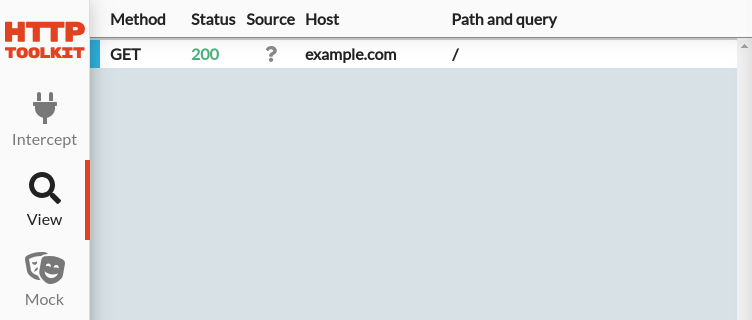

HTTP Toolkit allows you to intercept HTTP & HTTPS traffic from almost any HTTP client. Once you're intercepting traffic from a client, you can explore & examine it to understand what it's doing, or rewrite it to provide mock responses, inject errors, and test edge cases.

For interception, HTTP Toolkit acts as an HTTP & HTTPS proxy. You can set it up manually to work with any HTTP client that supports proxies, and it also comes with automatic setup for many specific tools.

To intercept traffic, open the 'Intercept' page of HTTP Toolkit (this is the initial page, if you've just opened the application). It looks like this:


You can click options here to intercept different clients, or search the options to find the right ones for your case. Not all options will be enabled: some are placeholders for future interception features, and some might not be available on your system.

## Intercepting HTTP from Chrome

_This step assumes you have Chrome installed._

Let's start by intercepting Chrome. Click the 'Chrome' interception option to launch a new Chrome instance. A Chrome window should appear within a few seconds, showing [AmIUsing.httptoolkit.tech](https://AmIUsing.httptoolkit.tech), a test site which you can use to confirm whether your connection is being intercepted:


This uses a separate Chrome profile, so will start as a clean browser, disconnected from other profiles and their settings, extensions & history that you might have on your machine. This allows you to continue using your existing browser separately from HTTP Toolkit, whilst intercepting the traffic shown in this browser.

Once Chrome has opened, you will see all traffic that it has sent and received on the 'View' page in HTTP Toolkit. Each request is shown on the left in the order they were sent, and they can be clicked to see their full details in the panel on the right.

Initially, you'll see a few requests that Chrome itself sends during startup. Visit another URL (why not try this page?) to explore the requests & responses of other web pages & applications.

## Intercepting HTTP from Node.js

_This step assumes you have Node.js installed._

HTTP Toolkit also allows you to intercept servers, scripts & command-line tools, such as Node.js applications.

To do this, click the 'Fresh Terminal' interception option to open a new intercepted terminal window. Within this window, various environmental variables & overrides are in place so that any applications started there are automatically intercepted. In every other respect though, it's just like any other terminal on your system, and you should be able to run commands just like normal.

Clicking that button is all the setup that's required. Now you just need to send some requests! As an example, you can send a request with Node.js's built-in client by running the below:

```js
$ node
> const https = require('https');
> https.get('https://example.com')
```



HTTP requests sent by almost all Node.js HTTP & HTTPS clients will be intercepted automatically, in addition to requests from most clients for Python, Java, Ruby, PHP, cURL, and many other languages & tools.

## Manually intercepting HTTP clients

To manually intercept traffic from a client that doesn't have automatic setup, you need to do two things:

* Configure the HTTP proxy settings to point to HTTP Toolkit
* Ensure the client trusts your HTTPS certificate (if you're using HTTPS)

The steps to do this vary significantly, depend on the specific client you're using, but there is normally an option or setting available to configure each of these.

You can find the specific settings required for your instance of HTTP Toolkit by clicking the 'Anything' interception option on the Intercept page.

## Next steps

Happily intercepting traffic?

Let's talk through the tools available for **[inspecting that intercepted traffic](/docs/getting-started/inspecting/)**.

## Troubleshooting

Struggling to get interception working? Here's some tips:

* If you need to test whether any client is working correctly, make a request to [`AmIUsing.httptoolkit.tech`](https://amiusing.httptoolkit.tech). You should see "You're not being intercepted" or "You're being intercepted", depending on whether your traffic is successfuly going through HTTP Toolkit

* If you're struggling to manually set up a client, there's two possibilities: either the client isn't using the HTTP proxy settings correctly, or it doesn't trust the certificate. In the former case, you should see "You're not being intercepted" when making requests to amiusing.httptoolkit.tech. In the latter case, you'll likely receive certificate errors, and you should be able to see rows showing failed or rejected requests on the View page.

* Terminal interception should be available on all machines, but it's possible that browser and other interception options might not be available on your machine, depending on the applications you have installed.

If you have an application installed but the interception option is still disabled, or if an option is enabled but it's not working for you, that's a bug! Please [file an issue](https://github.com/httptoolkit/feedback/issues/new) so we can get this fixed.

Any other questions? Feel free to [get in touch](/contact/).
