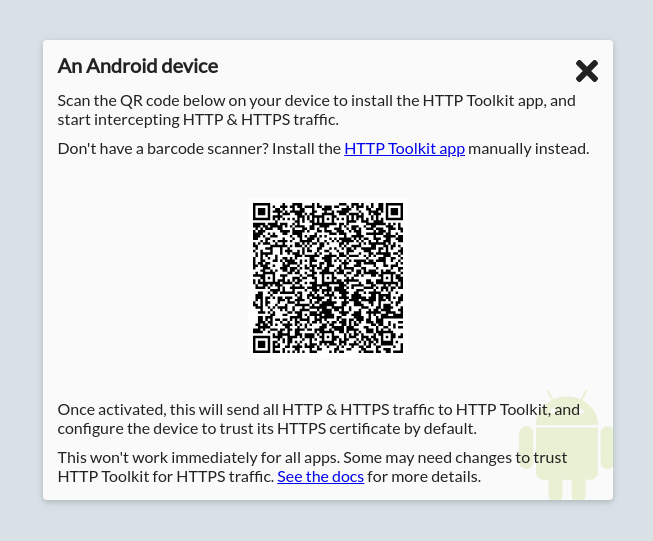
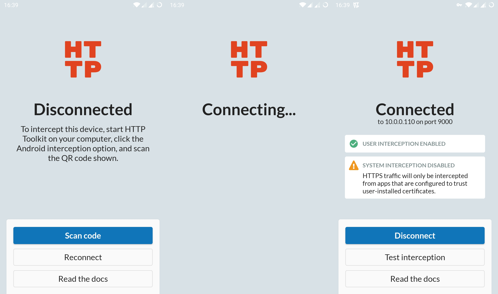

HTTP Toolkit can intercept, inspect & rewrite traffic from Android devices.

Plain HTTP traffic plus all HTTPS traffic from Chrome, webviews and applications that trust the user certificate store will be intercepted completely automatically.

For other apps, manual changes may be required to intercept HTTPS traffic. For your own apps these changes are very simple, whilst for 3rd party apps it can be more involved.

See ['intercepting HTTPS traffic from your own app'](#intercepting-traffic-from-your-own-app) or ['intercepting HTTPS traffic from 3rd party apps'](/#intercepting-traffic-from-3rd-party-apps) below for more details.

## Getting set up

First time set up requires installing the HTTP Toolkit app, scanning a QR code, and accepting two Android security prompts to enable interception. Once that's done, future setup just requires scanning a code once.

To get started:

1. Start HTTP Toolkit on your computer and click the 'Android device' interception option to expand it:
    
1. Scan the code to start setup.

    If you have a QR code reader:

    1. Scan the code shown and open the link within.
    1. This will take you to Google Play. Install & open the app from there.
    1. HTTP Toolkit will automatically begin interception setup.

    If you don't have a QR code reader:

    1. Install [the HTTP Toolkit app](https://play.google.com/store/apps/details?id=tech.httptoolkit.android) from the play store.
    1. Start the app, press 'Scan Code', and give HTTP Toolkit permission to access your camera.
    1. Scan the code to begin interception setup.
1. Accept each of the shown Android prompts to set up interception:

    You'll be asked to allow HTTP Toolkit to act as a VPN, redirecting your network traffic.

    * Your traffic is never sent to any remote servers, only to your local HTTP Toolkit instance.
    * The VPN is only active when HTTP Toolkit is configured. A notification is always shown whilst the VPN is active.
    * The VPN works by rewriting all outgoing traffic on port 80 & 443, sending it to your local HTTP Toolkit instance instead.

    You'll then be prompted to trust HTTP Toolkit's Certificate Authority (CA) certificate.

    * This allows secure HTTPS traffic to be intercepted by HTTP Toolkit.
    * On some devices, this will require you to confirm your device PIN, password or pattern, or to configure one if your device doesn't have one.
    * The CA used was generated by your computer's HTTP Toolkit instance, and isn't shared with anybody else or any other devices.
    * If you'd like to remove this CA later, go to Settings -> Security -> Encryption & Credentials -> Trusted Credentials, and remove it from the 'User' tab.
1. You're done. The app should say 'Connected', which means HTTP Toolkit is now be intercepting your device.

These prompts are only required for the first use.

In future, just open the HTTP Toolkit app (or any other barcode scanner), scan the code shown on your computer, and interception will start again automatically.

You will be prompted again to trust new certificates if you use HTTP Toolkit with a different computer, or when the CA certificate expires (one year after it was created, by default).



## Intercepting browser traffic

All traffic sent by Chrome on Android will trust the HTTP Toolkit certificate automatically, after the application is set up.

This also applies to webviews inside applications, and to many other browsers including Brave & Microsoft Edge.

Behaviour of non-Chromium browsers varies. In general these should be treated like [intercepting a 3rd party app](/#intercepting-traffic-from-3rd-party-apps), but many browsers will have their own options available to manually trust HTTPS CA certificates.

## Intercepting traffic from your own app

If you are targeting an Android API level below 23 (below Android 7), your application will trust the automatically installed certificate automatically, and no changes are required.

If not, you need to explicitly opt in to trusting the certificate. You'll know this is happening because you'll see messages in HTTP Toolkit like "Certificate rejected for connection to..." and "Aborted connection to..." and "HTTPS setup failed for...". Each of these typically means the application rejected our HTTPS interception before sending its requests.

To fix this you need to trust user-installed certificates in your app, like so:

### If you don't have a custom network security config:

1. Put the below into a file in your application's XML resources folder called `network_security_config.xml`:
  ```xml
  <?xml version="1.0" encoding="utf-8"?>
  <network-security-config>
      <base-config>
          <trust-anchors>
              <certificates src="system" />
              <certificates src="user" overridePins="true" />
          </trust-anchors>
      </base-config>
  </network-security-config>
  ```
2. Add `android:networkSecurityConfig="@xml/network_security_config"` to the `<application>` element in your application manifest.

That's it!

This configures your application to trust both built-in & user-added CA certificates for all HTTPS connections, for debug & release builds.

You can include this in your config at all times, and it will work with and without HTTP Toolkit. The only risk is that your end users will be able to intercept their own HTTPS traffic from your app, and potentially any users who are tricked into trusting an attacker's CA could have their traffic intercepted. For most applications that isn't a major concern.

If you'd like to enable this only for your debug builds, replace `base-config` with `debug-overrides` in the XML above.

See Android's [network security config documentation](https://developer.android.com/training/articles/security-config) for more details.

### If you already have a custom network security config:

Add `<certificates src="user" overridePins="true" />` within the `<trust-anchors>` element of either your `<base-config>` element (to trust user-added certificates for all builds) or `<debug-overrides>` (to trust user-added certificates in debug builds only).

See Android's [network security config documentation](https://developer.android.com/training/articles/security-config) for more details.

## Intercepting traffic from 3rd party apps

To intercept traffic from 3rd party apps that don't trust the HTTP Toolkit CA certificate, you need to either do some reverse engineering, or install the app in an emulator or rooted device.

In an emulator/rooted device it's possible to work default certificate restrictions by editing the system certificates directly, instead of just using user certificates. Doing this will work for the most Android apps, as long as they haven't explicitly locked down the certificates they expect (known as [certificate pinning](https://security.stackexchange.com/questions/29988/what-is-certificate-pinning)).

If that doesn't work or isn't possible, you'll need to edit your target application somehow.

On rooted devices or emulator, the best option to do this is [Frida](https://blog.jamie.holdings/2019/01/19/advanced-certificate-bypassing-in-android-with-frida/). Frida is a framework for dynamic application injection. Once installed, it can rewrite apps on your device on demand to remove most cert pinning restrictions.

If you don't have a rooted device, it's still possible to rewrite the application externally. To do so, you first need to download an APK for the application. [ApkPure.com](https://apkpure.com/) is a useful site to do this for most apps on the Google Play store. You may also be able to retrieve an APK from a device with the application, by using `adb shell pm list packages -f -3` to get the path to installed applications, and `adb pull <apk path>` to pull the APK itself.

Once you have the APK, you'll need to edit the application to trust user certificates and disable any certificate pinning. You can do this using [apk-mitm](https://github.com/shroudedcode/apk-mitm). Apk-mitm automatically opens up the APK, makes the network security config transformations described above, disables most standard certificate pinning, and rebuilds the application ready to be reinstalled.

This isn't foolproof. If it doesn't work, you can run apk-mitm with the `--wait` argument, which allows you to explore the decompiled source of the application, and make your own changes manually before resuming repackaging.