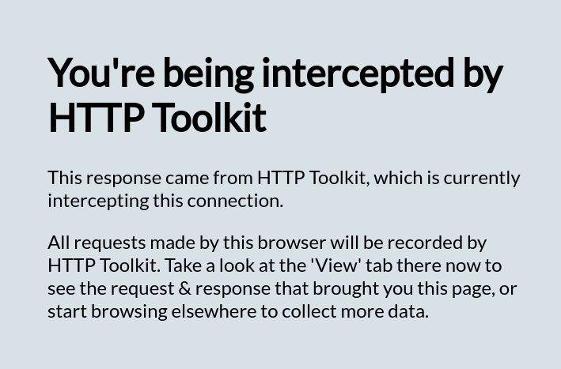

The [amiusing.httptoolkit.tech](https://amiusing.httptoolkit.tech) site is a built-in test site for HTTP Toolkit.

It's a real domain & test site, which you can browse to or request at any time to check whether your interception setup is working correctly. This is also the initial page opened by all browser interception options.

If your traffic is being correctly intercepted, by default you'll see a page with the title:

> You're being intercepted by HTTP Toolkit

That page looks like this:



This is powered by a mock rule, shown on [the Mock page](/docs/reference/mock-page) in the HTTP Toolkit app, and can be changed or removed. The built-in page content may also change in future, but if you want to reliably detect this programatically there's a few options:

* Check for a `httptoolkit-active: true` HTTP header, which is sent with this response.
* Parse the page, find the element with id `amiusing`, and check its contents. By default this is:
  ```html
  <script type="application/json" id="amiusing">
      { "amiusing": true }
  </script>
  ```
  The non-intercepted page also includes this element, but with a `false` value: `{ "amiusing": false }`.

If you're not being intercepted you'll see a bright red page that says:

> You're not being intercepted by HTTP Toolkit

That page looks like this:


Typically this means that your HTTP client is not using the proxy settings for this connection. It's also possible that you've removed, edited or overridden the mock rule that powers this page.

**Any questions? [Get in touch](/contact)**