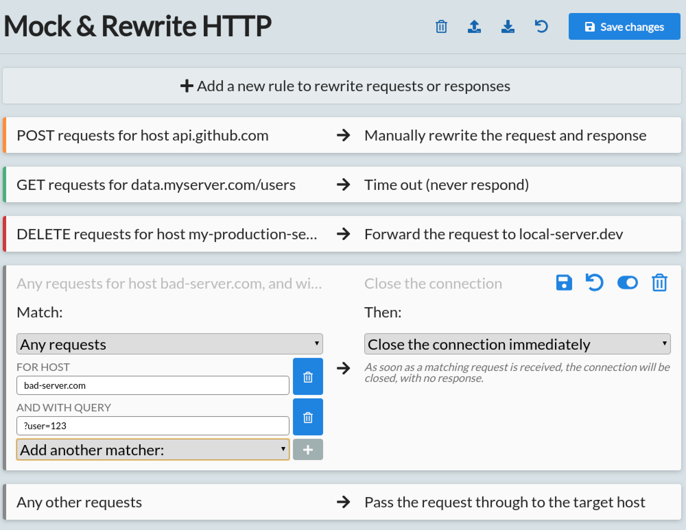
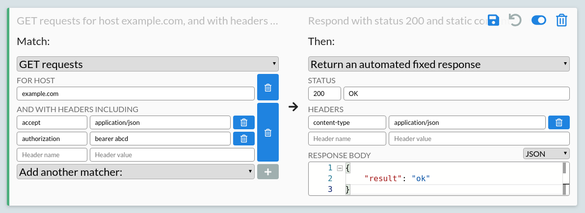
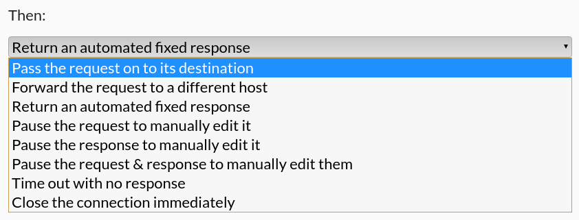

The Mock page allows you to rewrite traffic, to simulate fake servers, test edge cases, or change real HTTP requests and responses in any other way you'd like.

It shows a list of rules, which define how all HTTP traffic is handled. Each rule has a matcher and an action. The matcher defines which requests it applies to, and the action defines what happens to matching requests.

Every request is matched against each rule one by one from the top, until a matching rule is found, and the action for that rule is then run. Only one rule ever matches any request. If no rule matches, the request receives a 503 error, where the body explains the details of the request, and the details of the existing rules that didn't match.

Rule changes only take effect when saved. You can save all changes to rules from the button at the top, or save any one individual rule from the button on its row.

## Page structure

The Mock page consists of a set of controls at the top, an 'Add a new rule' button, and a reorderable list of existing rule rows.

### Mock page controls

The controls at the top are, from left to right:
- Clear all: resets all rules to default. This deletes all custom rules, and all changes from the built in rules.
- Import rules: this imports a set of exported rules, replacing all existing rules (_requires [HTTP Toolkit Pro](/get-pro)_).
- Export rules: this exports the current set of rules to a file, for your own use later or to share with others (_requires [HTTP Toolkit Pro](/get-pro)_).
- Revert changes: reverts all unsaved changes to rules.
- Save all: this saves all unsaved changes to all rules.

### Add new rule

This button creates a new rule at the top of the list. New rules always start matching nothing, and passing any matched requests on to the real server (i.e. effectively doing nothing). You'll want to change those, and then save the rule.

### Rule rows

You typically start with two rules: a rule that provides a test page at amiusing.httptoolkit.tech, and a rule which forwards all unmatched traffic to the real target server. You can edit or remove either of these if you'd like.

Hovering over any rule will show a draggable tag on the left, and a set of controls that can be used to manage the rule.

Each rule row shows these 4 controls in the top right. You can hover over any button to see a short description. From left to right, they are:

* Save rule / collapse rule (depending on whether there are unsaved changes).
* Revert unsaved changes to this rule.
* Deactivate/reactivate rule (note that you will need to save the rule for this change to apply).
* Delete rule (note that you will need to save the full list of rules for this change to apply).

Rules can be reordered by hovering over the rule whilst it is collapsed, and dragging it using the draggable tag that appears. For keyboard use you can tab to this tag, which will appear if previously invisible, start dragging with enter or space, select a position with the arrow keys, and place the rule with enter/space again.

To edit any rule, click it or press enter on it in the list, and it will expand to show its details. You can collapse it again from the chevron button in the top right. If you've made changes, that becomes a save button, which will save the changes to this rule before collapsing it. To avoid saving changes, first use the revert button, which will put the rule back to its last saved state.

Within each row, you can see:

* A top line, showing a summary of the matcher and action currently selected. This is greyed out when the rule is expanded.
* A colour marker on the left. This corresponds to the HTTP method matched, to allow easier skimming within large lists of rules.
* A set of matchers on the left.
    * These are combined together, so that requests will match only if all matchers match the request.
    * Change the first dropdown to match by HTTP method (or to ignore the method entirely).
    * More specific matchers that have been added are shown below this, with their editable configuration.
    * Press the delete button next to any matcher to remove it.
    * Use the dropdown at the bottom to select a new matcher, then configure it, and click the + button to add it to the rule.
* A single action on the right.
    * This action will be applied to all matching requests as they arrive.
    * Change the dropdown at the top to select the action to use.
    * The configuration and an explanation for the selected action will appear below..

Some matchers and actions have validations, for example host matching requires a valid hostname. If any data is invalid, it will be marked with a warning icon, and the rule will not be changed until you provide a valid value.

## Matchers

There are a variety of matchers available to filter the requests that a rule will affect:

* An HTTP method or 'any requests'. This is always shown as the top matcher, and filters requests by the HTTP verb used.
* A host. This matches requests to a given hostname, regardless of the protocol, path or query string provided.
* A URL:
    * This matches an absolute or relative URL, excluding the query string.
    * Matching `/abc` will match that path regardless of the host or protocol.
    * Matching `example.com/abc` will match that host and path, regardless of the protocol.
    * Matching `https://example.com/abc` will match only that exact URL.
* A URL matching a regular expression:
    * This matches any request whose relative or absolute URL (excluding the query string) matches the given regular expression.
    * Matching `^https:` will match all HTTPS requests.
    * Matching `^/abcd?` will match requests to path `/abc` or `/abcd` on any host.
* An exact query string:
    * This matches any request with the exact query string provided.
    * If empty, this matches only requests with no query parameters at all.
    * If set, this matches the exact query string provided.
* Including headers:
    * This takes a list of name/value header pairs.
    * It will match any requests that include those pairs of headers.
    * Edit the last name/value row to add a new pair.
    * Use the delete button on any row to remove any pair.

After selecting and configuring the matcher, press the + button on the right of the matcher to add it to the set of matchers for this rule, and then use the save button to save the rule.

_Have suggestions for other matchers you'd like to see? File [some feedback](https://github.com/httptoolkit/feedback/issues/new), or contribute them directly [for yourself](https://github.com/httptoolkit/httptoolkit-ui#contributing)._

## Actions

There are a variety of actions available, to apply different effects to the matched requests:

* Pass the request on to its destination: This proxies the request to its target server, and returns the server's response, with no changes.
* Forward the request to a different host:
    * This changes the target server of the request.
    * By default the 'Host' header is also updated to match, although this can be disabled.
* Return an automated fixed response:
    * Request triggering this rule are never sent upstream to any real server, but receive a response directly from the proxy.
    * The response status, status message, headers and body can be specified manually.
    * Header rows can be added by editing the final name/value pair, or deleted using the delete button next to each individual row.
    * The body editor is based on [Monaco](https://github.com/microsoft/monaco-editor) (the internals of Visual Studio Code), so includes many of its features, including syntax highlighting, regex search, and code folding.
    * The syntax highlighting to use can be selected using the dropdown on the right of the body editor.
    * The body dropdown will automatically update the content-type header, and will automatically match type of the header if it is specified & recognized.
* Pause the request to manually edit it:
    * This will breakpoint each matched request as it is received, before it is sent upstream to the server.
    * When a matching request is received, HTTP Toolkit will immediately jump to the request on the View page to show it.
    * Requests can be manually edited, to redirect them to a different URL, edit the method, header or body content that will be sent upstream, or reply directly.
* Pause the response to manually edit it:
    * This will breakpoint each matched request after it has been sent upstream and a response has been received.
    * When a response for a matching request is received, HTTP Toolkit will immediately jump to the request on the View page to show it.
    * Responses can be manually edited, to edit the status code, status message, headers and body before they are returned to the initiating HTTP client.
* Pause the request & response to manually edit them:
    * Matching requests will be breakpointed both before they are sent upstream, and after a response is received from the upstream server.
    * This behaves as a combination of the previous two rules.
* Time out with no response: matching requests will never receive any response, and the connection will remain open until they time out (or until HTTP Toolkit is closed).
* Close the connection immediately: as soon as a matched request is detected, the connection will be immediately closed with no response.

After selecting and configuring an action, remember to save the rule to begin applying it to matching traffic.

_Have suggestions for other actions you'd like to see? File [some feedback](https://github.com/httptoolkit/feedback/issues/new), or contribute them directly [for yourself](https://github.com/httptoolkit/httptoolkit-ui#contributing)._

**Any questions? [Get in touch](/contact)**