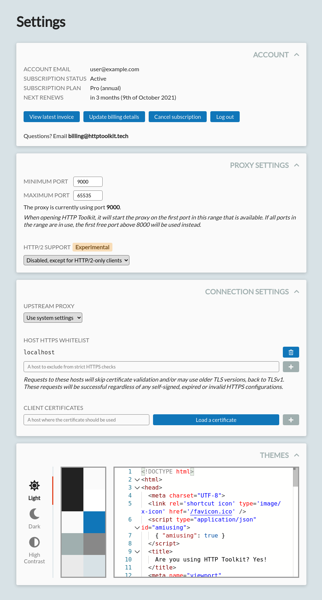
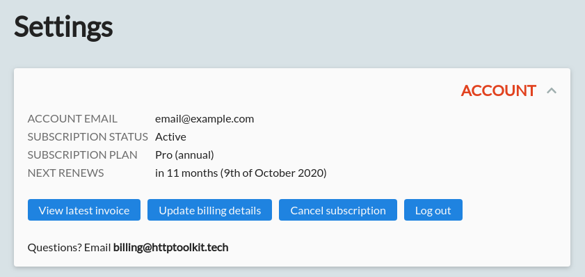
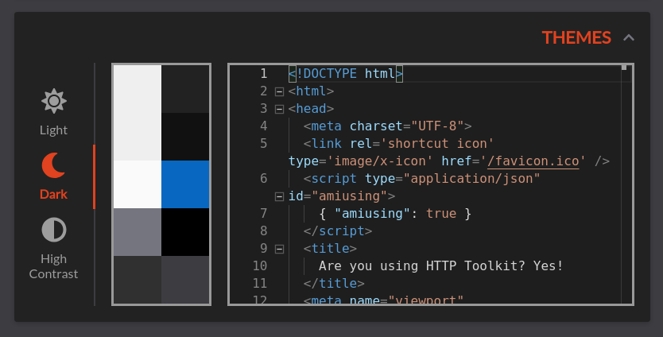

The Settings page is only available to [HTTP Toolkit Pro](/get-pro) users. It allows you to configure extra proxy settings, UI themes, and manage your account.

It looks like this:

There are three cards here, each of which can be collapsed or expanded as required by clicking or pressing enter on the title and chevron in the top right. The cards are:

* The Account card, which allows you to manage your user account and subscription
* The Proxy Settings card, which allows you to configure extra proxy settings
* The Themes card, which allows you to select themes and see their settings at a glance.

## Account Settings

The account card shows the details of your current account:

* The email address that you've used to log in.
* Your current subscription status:
    * Active: you have an active subscription that is renewing as normal.
    * Active (Trial): you have an active subscription that's still in the trial phase.
    * Past due: you have an active subscription that's failed to renew, and will expire shortly if not resolved.
    * Cancelled: your subscription is currently active, but has been cancelled, and will expire shortly.
* Your subscription plan: Pro or Team, Annual or Monthly.
* Your next payment date:
    * When your subscription next renews, if it's active or on a trial
    * When the payment will next be retried, if you're currently past due
    * When your subscription will fully expire, if it's cancelled.

Cancelled users retain access to paid features until the end of their last paid subscription period.

Subscriptions that are past due will have their payments retried automatically a few times over the following week, and you'll be sent emails about this, with instructions on how to update your details or how to cancel immediately. If the payments succeed, the account will become active again as normal. If not, after the 3rd attempt the subscription will cancelled and expire immediately.

Below these details, there's a few buttons available:

* View latest invoice: opens your latest invoice in your browser.
* Update billing details: opens a page in your browser allowing you to update your payment method.
* Cancel subscription: opens a page in your browser allowing you to immediately cancel your subscription.
* Log out: logs you out, taking away your access to all paid features.

Pro users will see all of these buttons. Team members on an account where they are not the main billing user will see only the 'Log out' button.

## Proxy Settings

The proxy settings card allows you to reconfigure various settings of the internal HTTP Toolkit proxy.

Most changes here require a restart of the app to take effect, and a button will appear in the top left of the card allowing you to do that when required. Unsaved changes are shown by the greyed-out italicized rows with the save icon, as in the screenshot above.

There's a few settings you can edit here:

* The host certificate whitelist:
    * Upstream certificate validation will be skipped for every host included here.
    * That means that if these servers have expired, self-signed or otherwise invalid certificates, that will be ignored, and won't be reported to downstream HTTP clients.
    * By default, for both Pro & free users, `localhost` HTTPS certificates are always trusted, but for advanced uses it may be useful to add other servers.
* Client certificates:
    * Here you can install client certificates, which will be used for requests to the given host name.
    * Enter a hostname and click the 'Load certificate' button to load a certificate. Certificates must be in PKCS#12 (.p12 or .pfx) format.
    * If required you'll be prompted for a passphrase (as shown above). Enter your passphrase and press the unlock button to test it.
    * Once your certificate is loaded & unlocked, and you've entered the hostname, press the + button to save it.
    * Note that client certificates are necessarily stored unencrypted in HTTP Toolkit's settings on disk. They are never shared outside your machine, but this could be a concern if an attacker has access to your hard drive. If this is an issue, you can remove the certificate from your settings after use to immediately remove it from storage.
* Proxy port ranges:
    * On startup, HTTP Toolkit will listen on the first available port in this range. By default that is any port above 8000.
    * You can configure this yourself, which can be useful if you want more precise control, or you intend to use port 8000 for another process.
    * If every single port in the range is unavailable, HTTP Toolkit will fall back to its default settings and use the first free port above 8000.

## Themes

The theme settings card allows you to change the app theme.

Select one of the three themes on the left to immediately change the whole app's theme.

All colours used in the theme are shown on the right, along with an editor containing some example HTML (actually the contents of the default intercepted [amiusing.httptoolkit.tech](https://amiusing.httptoolkit.tech) page!), so you can see it all live.

**Any questions? [Get in touch](/contact)**