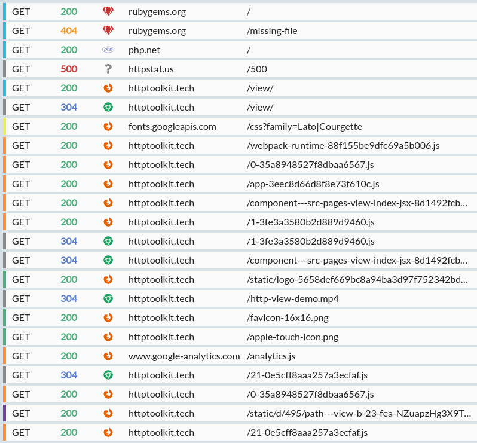
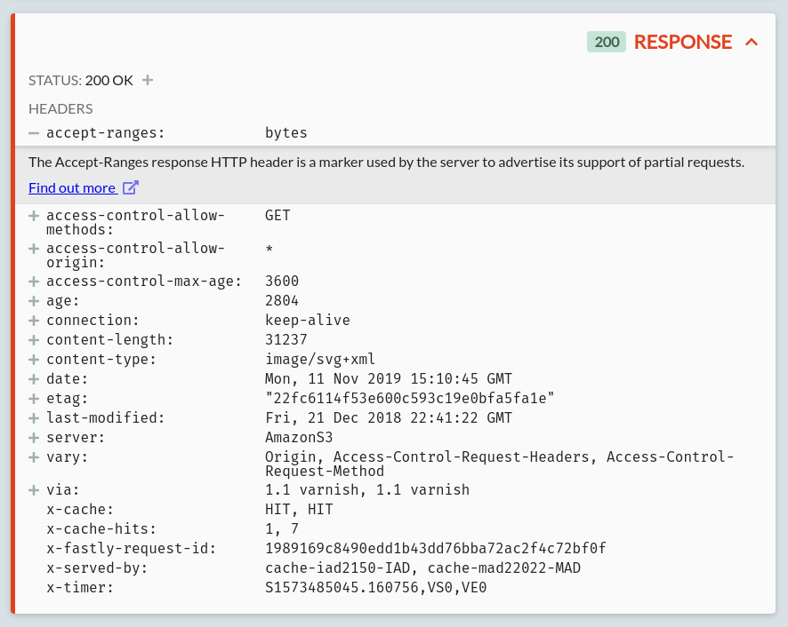
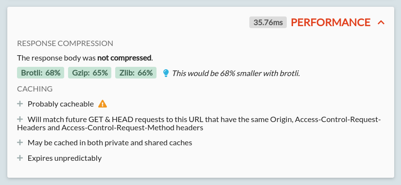
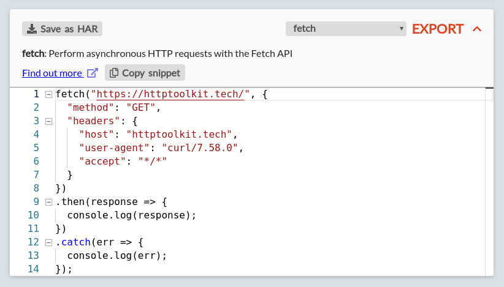
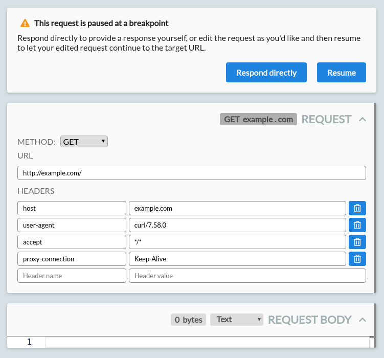
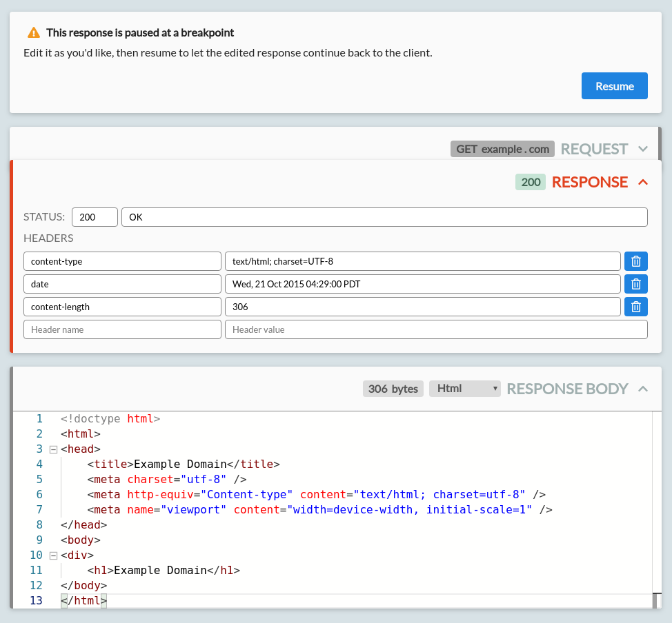

On the View page you can examine collected HTTP and HTTPS traffic up close.

It shows the traffic collected from HTTP clients that you've intercepted, and/or past HTTP traffic that you import from a HAR file.

The page is in two parts:

* On the left, a list of HTTP events, with some controls to explore those.
* On the right, a pane that shows the details of the selected event, if any.

You can drag the central divider to resize either half as you'd like.

## The exchange list

The exchange list shows a list of the HTTP events, in the order they happened. For HTTP exchanges, that's the order the requests were initially sent.

There's a few possible types of event:

* An HTTP exchange. This consists of a request, which might still be in progresss, might be at a breakpoint, might have completed with a response, or might have failed permanently.
* A failed TLS connection. This is an HTTPS request that has failed to setup the initial connection, perhaps due to the HTTP Toolkit certificate being rejected, or a connection being cancelled.

### HTTP Exchanges

Each exchange row shows:

* A colour marker, giving an at-a-glance summary of each request:
    * Black: Incomplete/failed
    * Red: Mutative (e.g. POST/DELETE)
    * Green: Image
    * Orange: JavaScript
    * Yellow: CSS
    * Light blue: HTML
    * Dark blue: Fonts
    * Purple: Data (XML, protobuf, form data or JSON)
    * Grey: Unknown

    (Don't worry, you don't need to memorize these! All details of each exchange are available separately, these just help with quickly skimming the list)
* The HTTP method used, with different colours for each verb.
* Either:
    * The response status code, also colourized.
    * &#128683 if the response did not complete.
    * &#9888 if the exchange is currently paused at a breakpoint.
    * A spinner, if the response is still in progress.
* The source of the request, as an icon (e.g. Firefox, Chrome, or a specific language) when it's known. You can hover over this icon for more details.
* The URL of the request, separated into the host and the path & query. Long URLs may be truncated here, but the full URL is available as a tooltip if you mouseover the row, or in the details pane if you select the row.

To see more details on any row, click it to select it, and it'll be shown in the details pane on the right. More details on that below.

### The list controls

At the bottom of the list, there's a few useful controls:

* A search bar. This filters the visible events by string matching, for their:
    - Request methods.
    - Request URL.
    - Protocol (HTTP/HTTPS).
    - Request header keys or values (use `key: value` to match both together).
    - Response status code.
    - Response status message.
    - Response header keys or values.
    - (Note that request & response bodies are not searched, for performance)
* The number of events shown, if your current filter is hiding any events.
* The total number of events in the list.
* A button to pause/resume interception.
    * When interception is paused, traffic will continue to pass through the proxy as normal, but will not be collected or shown.
    * When interception is resumed, traffic is once again collected.
* A button to export the currently visible exchanges as a [HAR file](https://en.wikipedia.org/wiki/HAR_(file_format)), usable with many other tools (_requires [HTTP Toolkit Pro](/get-pro)_).
* A button to import a HAR file. These imported exchanges are appended to the list of events, and won't remove any events already present  (_requires [HTTP Toolkit Pro](/get-pro)_).
* A button to clear the event list, deleting all events from memory.

## The event details pane

The right pane is made up of a series of 'cards': collapsible sections, which provide different views of the details of the selected event. You can see an example of each card below.

For an HTTP exchange, there's a few cards that will be shown:

* The request details.
* The request body (if there is one).
* If a response has been received:
    * The response details.
    * The response body (if there is one).
* The performance details (_requires [HTTP Toolkit Pro](/get-pro)_).
* The export options (_requires [HTTP Toolkit Pro](/get-pro)_).
* Breakpoint cards, for breakpointed requests and responses.

### The Request Card

For [HTTP Toolkit Pro](/get-pro) users, the request card may show metadata & validation, for requests to recognized APIs. This is powered by the OpenAPI specifications of the [OpenAPI Directory](https://github.com/APIs-guru/openapi-directory). As an example:

Here, a request to the GitHub API is recognized as such, so includes:

- The service the request is going to, with links to its docs
- The name of the operation itself
- A list of the parameters being specified, each including:
    - The name & value of the parameter
    - Documentation for the specific parameter, with a description and the valid possible values
    - Validation & warnings, for invalid or missing values, and deprecated parameters or operations

In addition to API metadata for Pro users, for all users this card shows the core request data: the HTTP method, URL & headers sent.

All standard methods and headers will be recognized, and clicking the plus symbol next to them will show a quick explanation of what they mean, with links to the Mozilla Developer Network's full documentation for that method or header.

The URL can also be expanded, to show it broken down for readability into the protocol, host, path, and each of the query string parameters included.

### Body Cards

Both requests and responses can have bodies, and when present, the corresponding request or response body card will be shown. These both work exactly the same, and both can appear at the same time, e.g. for a POST request with a 200 response.

This card consists of a viewer for the body content, plus a few controls. Let's start with the controls:

* A copy button: this copies the currently shown body content to your clipboard.
* The number of bytes: this shows the numbers of bytes in the content itself. This is the content after decoding bodies, which may have been gzipped for example, but ignoring any content autoformatting in the editor shown.
* A dropdown to select the formatting for the body viewer. This is filtered to provide only meaningful options for each content type. There's a few options:
    * Image - an image, shown as an actual image.
    * Hex - the raw bytes of the body, in formatted hexidecimal.
    * Text - the content of the body when decoded as UTF8 text.
    * XML - the content of the body decoded as UTF8 text, autoformatted as XML, with syntax highlighting.
    * JSON - the content of the body decoded as UTF8 text, autoformatted as JSON, with syntax highlighting.
    * JavaScript - the content of the body decoded as UTF8 text, autoformatted as JavaScript, with syntax highlighting and intellisense.
    * HTML - the content of the body decoded as UTF8 text, autoformatted as HTML, with syntax highlighting.
    * CSS - the content of the body decoded as UTF8 text, autoformatted as CSS, with syntax highlighting.
    * Markdown - the content of the body decoded as UTF8 text, with markdown syntax highlighting.
    * YAML - the content of the body decoded as UTF8 text, with YAML syntax highlighting.

The viewer itself appears below, showing the content formatted according to the formatting dropdown.

The viewer is powered by a read-only [Monaco editor](https://github.com/microsoft/monaco-editor) (the internals of Visual Studio Code), and includes many of the features of Visual Studio Code. For example:

* Syntax highlighting, with errors for invalid syntax.
* Type inference & intellisense, for JavaScript.
* Collapsible blocks (use the +/- in the left margin).
* Plain text and regex search (press Ctrl/Cmd + F).
* Match highlighting: select and text to see all other occurances highlighted in the text and the scrollbar.
* Inline color tags, for colors defined in CSS content.

### The Response Card

The response card shows the HTTP status code, status message, and response headers. For [HTTP Toolkit Pro](/get-pro) users, the response status itself may come with further explanations powered by any detected OpenAPI specifications from the [OpenAPI Directory](https://github.com/APIs-guru/openapi-directory).

All standard status codes and headers on this card are automatically recognized, and clicking the plus symbol next to them will show a quick explanation of what they mean, and links to the Mozilla Developer Network's full documentation for that status or header.

### The Performance Card
_Only available with [HTTP Toolkit Pro](/get-pro)_

The performance card shows the performance details for the given response. These include:

* The exact time taken for the full request and response
* For both the request & response bodies:
    * The compression algorithm used, and its relative (percentage reduction) & absolute (bytes saved) performance
    * The potential improvements with alternative compression algorithms:
        * When improvements are available, the algorithm is shown as green, and a suggestion appears alongside. This suggestion will include a note if your current HTTP client does not advertise support for the best available compression algorithm
        * A warning will be shown if the current compression algorithm is _increasing_ the size of the the body
        * For each algorithm, the specific compressed & uncompressed sizes can be seen by hovering over its result
        * Exact results might vary slightly from those shown, depending on the settings used, but they should be representative
* The caching behaviour of the given request with explanations:
    * This is separated into a few sections:
        * Whether the response is cacheable at all
        * Which future requests can reuse this response from the cache
        * Which types of cache are allowed to store the response
        * When the response will expire, and how and when it should be revalidated
    * Each section can be expanded to see an explanation of the given behaviour
    * Sections with potential improvements or issues will be shown with a lightbulb or warning icon, respectively
    * The explanations here indicate the behaviour allowed by the caching standards. Individual cache behaviour will depend on these, but can vary further. For example, caches are not obliged to cache cacheable content, but should never cache non-cacheable content.

### The Export Card
_Only available with [HTTP Toolkit Pro](/get-pro)_

The export card allows you to export a given request & response as a HAR file, or to export the request as ready-to-use code for a wide selection of languages.

You can export the exchange as a HAR file by clicking the 'Save as HAR' button in the top left. This exports this individual exchange into a standalone file. Note that's it's also possible to export the full set of currently filtered exchange from the exchange list on the left, using the export button in the list footer.

To export as a code snippet, first pick your language or tool of choice from the list. The list includes:

* C: Libcurl
* Clojure: clj-http
* C#: RestSharp
* Go: NewRequest
* Raw HTTP/1.1
* Java:
    * OkHttp
    * Unirest
* JavaScript
    * jQuery
    * fetch
    * XMLHttpRequest
* Node.js:
    * HTTP
    * Request
    * Unirest
* Objective-C: NSURLSession
* OCaml: CoHTTP
* PHP:
    * cURL
    * HTTP v1
    * HTTP v2
* Powershell:
    * Invoke-WebRequest
    * Invoke-RestMethod
* Python:
    * http.client
    * Requests
* Ruby: net::http
* Shell:
    * cURL
    * HTTPie
    * Wget
    * NSURLSession

A short description of the client and a link to its full docs will be shown in the body of the card, followed by the full code snippet (shown in a Monaco editor, with all the same features of the body editors described above).

You can copy the entire snippet using the 'Copy snippet' button, or copy individual segments of the snippet by hand.

Each snippet is intended to be representative ready-to-use code for the given target, but you should pay attention to application specific details, and be aware they you may need to customize security settings (e.g. certificate trust & validation) and add appropriate error handling for your specific environment.

### Breakpoint Cards

When viewing a request or response that is paused at a breakpoint, some other cards may not appear, or may be replaced by editable cards. The rules that trigger breakpoints can be configured on [the Mock page](/docs/reference/mock-page).

Breakpointed requests can be edited before they are sent upstream to their target server, or you can respond to them directly without forwarding the request. Breakpointed responses can be edited before they are returned to the initiating HTTP client.

A breakpointed request looks like this:

From here, you can:

* Change the request method.
* Edit the request URL:
    * You can change the request protocol, path or query.
    * Alternatively, edit the hostname to redirect it to a different server entirely.
    * Editing the hostname will automatically update the Host header to match.
* Edit the request headers.
    * Edit the empty name/value row at the bottom to add new headers.
    * Click the delete button shown on any existing row to remove existing headers.
* Edit the request body.
    * You can select the syntax highlighting to use with the dropdown on the right.
    * If there is a content-length header set that matches the body length, editing the body will automatically update the header to match.
    * The body is shown in its decoded form. If a content-encoding header is set, the body will be re-encoded before the request is forwarded.

Press 'Resume' in the breakpoint header to forward your request on to the target server.

You can also press 'Response directly' to skip forwarding the request entirely, and instead manually provide your own response. This triggers an immediate response breakpoint, for an empty response.

A breakpointed response looks like this:

From here, you can:

* Edit the status code or status message that will be returned.
* Edit the response headers.
    * Edit the empty name/value row at the bottom to add new headers.
    * Click the delete button shown on any existing row to remove existing headers.
* Edit the response body.
    * You can select the syntax highlighting to use with the dropdown on the right.
    * If there is a content-length header set that matches the body length, editing the body will automatically update the header to match.
    * The body is shown in its decoded form. If a content-encoding header is set, the body will be re-encoded before the request is forwarded.

When you're done, press resume to let the response continue back to the HTTP client.

There are a couple of other things about breakpointing worth noting:

* When hitting a response breakpoint, request data has already been received, and can be seen in the cards above the editable response.
* Whilst waiting at a breakpoint, your client is not receiving content, and may time out. If this happens, your breakpoint will close suddenly, and will appear like any other timed out or aborted request. To avoid this, increase the timeout in your client, or edit quickly!
* After your breakpointing is all done, the exchange content shown is always the data from the perspective of the client. That means:
    * The edited request data will not be shown - you'll see the data that the client actually sent, not the data sent to the server.
    * The original response data will not be shown - you'll see the data that the client actually received, not the data received from the server.

**Any questions? [Get in touch](/contact)**