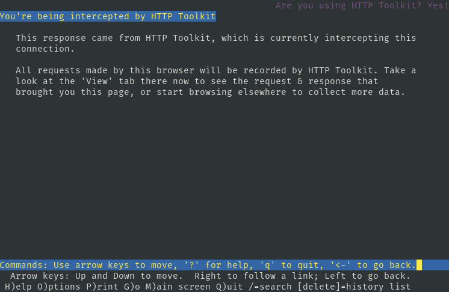

## Debug HTTP(S) from git, npm, apt-get, or any other CLI tool.

The command line is powerful, but can be hard to understand, and extremely hard to debug. Ever run a command, see it fail with a cryptic error, and have no idea why?

Better tools can help you understand what's really going on. They can let you see inside the command you're running to understand how it's communicating, see what data it's working with, and debug it in depth.

Excitingly I've just shipped one-click terminal interception to do exactly this with HTTP Toolkit, for HTTP and HTTPS, to show you everything your CLI is sending and help you work out what the hell is going on.

_HTTP Toolkit is free & open-source, so if you want to try this yourself, go [download it now](/) and dive right in._

## How do I try it?

* Install HTTP Toolkit (if you haven't already).
* On the Intercept page, click the 'Terminal' button.
* In the terminal that opens, make some HTTP requests (try `curl example.com`, `sudo apt-get update`, `git clone https://...`, or anything!)
* Open the View page in HTTP Toolkit, and take a look through the full details of every request sent.

## What can I do with this?

### Debug failing applications

Let's imagine you're using a CLI tool, and it hates you. For whatever reason, it refuses to do the perfectly reasonable thing you ask for. It exits with some cryptic error, or just fails silently, and you're stuck. Maybe you just downloaded it, or maybe it's your code and you've just forgotten how it works (we've all been there).

Internally perhaps this script is talking to an HTTP service somewhere, and failing later on. Unfortunately, you have no idea what it's asking for, what it gets in response, or why the result doesn't work. Most applications aren't designed to be debugged, and can be painfully opaque.

If you can intercept all HTTP from the app then you see everything that's being sent, spot the error, and fix the root cause directly. Is your script requesting a file from github and then crashing trying to use it? When you see that github is returning unexpected HTML instead of the download, because github is down _again_, the issue gets a little clearer.

### Spot creepy app tracking & monitoring

The future is a dark place. Think your CLI tool might be sending your private data back to analytics & tracking services? If you can see all HTTP it sends, you can see exactly what's being reported and know for sure.

Live editing coming soon too, so you can block/edit these requests in flight as well.

### Learn how your tools work

Ever wondered how Git actually works? No problem - open an intercepted terminal, clone a repo over HTTPS, and immediately read through every request it sends and receives to make that happen.

Apt-get [doesn't use HTTPS](https://whydoesaptnotusehttps.com) and instead distributes packages over HTTP, but with signatures that you can validate locally. That means every request your client makes is publicly readable though. Open an intercepted terminal, run a quick `sudo apt-get update`, and see exactly what that shares with the world.

Want to see how many requests your `npm install` is making under the hood? ...you get the idea.

## How does this work?

Automatic terminal interception works by starting a new terminal window on your machine, and ensuring it starts with various environment variables set. This doesn't strictly enforce HTTP interception, but these variables are observed by almost every language & HTTP library you use on the CLI, and it's enough to ensure that 90% of tools work out of the box.

These variables need to do two things: send all HTTP(S) traffic via the proxy, and then ensure that all HTTPS clients trust the interception certificate authority (CA) used by HTTP Toolkit. The variables used to make this happen are:

* `HTTP_PROXY` (and `http_proxy`) - the full URL for the proxy to use for HTTP traffic (e.g. `http://localhost:8000`)
* `HTTPS_PROXY` (and `https_proxy`) - the full URL for the proxy to use for HTTPS traffic (e.g. `http://localhost:8000`)

* `SSL_CERT_FILE` - the path to a file containing the certificate authorities (CA) certificates that OpenSSL should trust
* `NODE_EXTRA_CA_CERTS` - the path to the extra CA certificates that Node.js (7.3.0+) should trust
* `REQUESTS_CA_BUNDLE` - the path to the CA certificates that Python's [Requests](http://docs.python-requests.org/en/master/) module should trust
* `PERL_LWP_SSL_CA_FILE` - the path to the CA certificates that Perl's [LWP](https://metacpan.org/pod/LWP) module should trust
* `GIT_SSL_CAINFO` - the path to the CA certificates that Git should trust

Out of the box, across Windows, Linux & Mac, this immediately intercepts:

* Classic HTTP clients like Curl, Wget, and Lynx.
* More powerful tools built on HTTP(S), including Git, Apt-Get, and [HTTPie](https://httpie.org/).
* Almost all Ruby, Perl, Go, Bash, or Python scripts.
* All Node.js tools that correctly observe `HTTP_PROXY` (unlike most tools, [Node.js doesn't do this automatically](https://github.com/nodejs/node/issues/15620)). This does include npm though, and any requests made with libraries like Axios (0.14+) or Request (2.38+), or using [global-tunnel](https://github.com/np-maintain/global-tunnel).
* Probably much more. [Reports of issues/other working clients are very welcome!](https://github.com/httptoolkit/feedback/issues/new)

I suspect there'll be extra cases that could be caught with a few more env vars. If you have one, I'd love to hear from you. Either [file some feedback](https://github.com/httptoolkit/feedback/issues/new), or just open a PR [on the interceptor directly](https://github.com/httptoolkit/httptoolkit-server/blob/v0.1.3/src/interceptors/fresh-terminal.ts#L91-L110).

If this looks interesting, go [download HTTP Toolkit now](/) and try it out for yourself. Have feedback? File it [on Github](https://github.com/httptoolkit/feedback/issues/new), or get in touch [on Twitter](https://twitter.com/httptoolkit).
